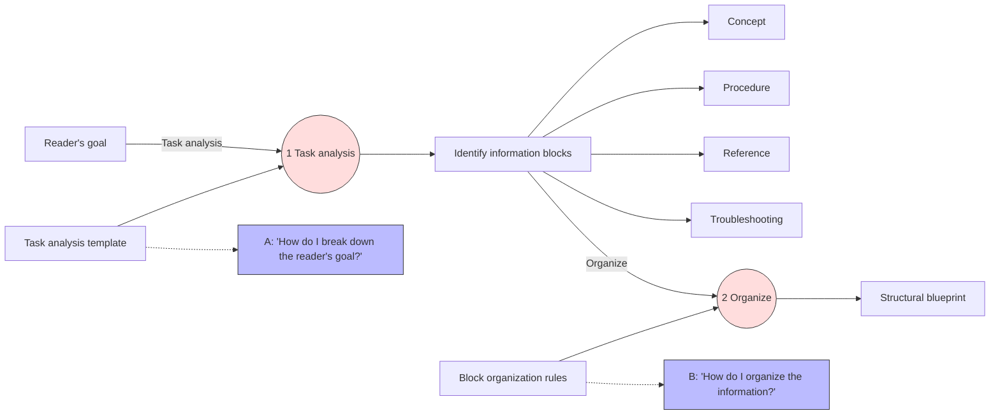
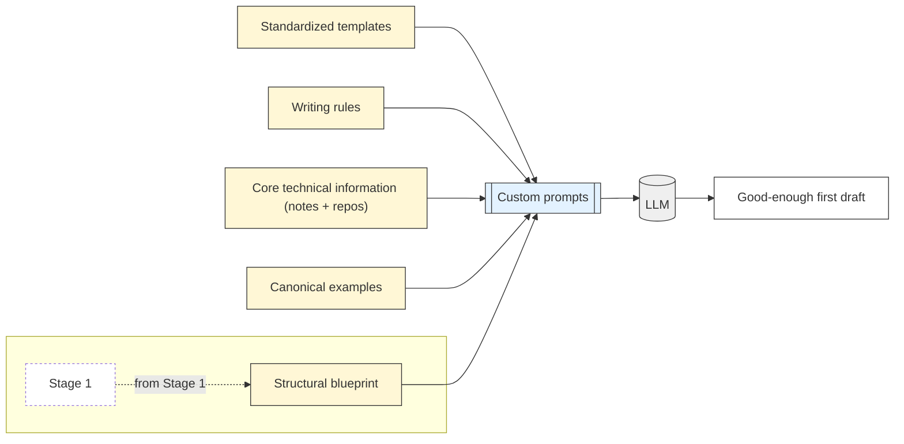
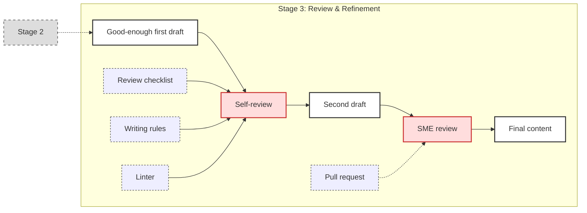
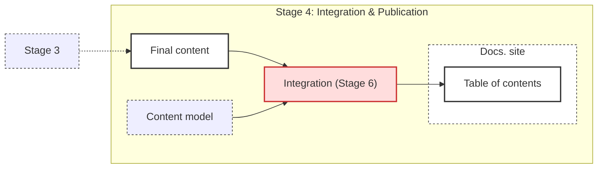

# End-to-end documentation guide

This guide is for the subject-matter experts (SMEs) who contribute to our products: the developers, infrastructure engineers, and other technical contributors responsible for designing and implementing features. It is written for technical experts who need to produce clear, effective documentation for the solutions they create, but who are not professional technical writers.

Our core assumption is that the primary barrier to writing documentation is not a lack of willingness, but the lack of a clear and repeatable process. This guide provides that process. It is designed to remove ambiguity, eliminate "blank page" anxiety, and provide a predictable workflow to create high-quality documentation consistently.

## How this guide is organized

This document provides a high-level overview of the documentation workflow, presented as a sequence of four distinct stages: designing the information, populating the content structure, validating the design, and integrating into the overall structure. It is designed to be a map that you can use to navigate the process from an initial idea to a final, published document.

This document does not contain exhaustive details. Instead, it functions as a central hub, providing direct links to the specific templates, checklists, writing rules, and external tools required to complete each step of the process. You can use it as a quick reference to find the resources you need for a specific task.

## The documentation workflow

This guide provides an end-to-end overview of the documentation process, from initial analysis to final integration. Use it to understand each part of the workflow and how they connect.

## Stage 1: Designing the information

| Element | Description |
|:--------|:------------|
| Description | Identify the reader’s goal, perform a guided task analysis, and decompose the goal into core information blocks (Concept, Procedure, Reference, Troubleshooting). Organize these blocks into a structural blueprint. |
| Goal | Define scope and structure before writing, ensuring alignment with the reader’s goal. |
| Input | Feature code, user stories, and any other existing documentation. |
| Output | A content organization plan (blueprint) that specifies what documents are needed and how information will be structured. |
| Tools | - Task analysis template - Information block organization rules |

## Stage 2: Populating the content structure

| Element | Description |
|:--------|:------------|
| Description | Translate the blueprint into a "good-enough" first draft by filling predefined templates with content drawn from technical sources. Use canonical examples and, where useful, LLMs to assist in generating text. |
| Goal | Produce a "good-enough" first draft that matches the designed structure and reduces ambiguity in what needs to be written. |
| Input | Structural blueprint from Stage 1, technical notes, repository content, templates, and examples. |
| Output | A structured "good-enough" draft of the required document(s). |
| Tools | - Templates - Canonical examples - Writing rules - Custom prompts for LLM assistance |

## Stage 3: Validating the design

| Element | Description |
|:--------|:------------|
| Description | Improve and refine the draft through self-review, applying checklists, writing rules, and linters. Incorporate additional content as needed. Submit the draft in a GitHub pull request, where SMEs review for technical accuracy and confirm that the content effectively supports the user. |
| Goal | Ensure the documentation is accurate, complete, and structured according to the design. |
| Input | "good-enough" draft from Stage 2. |
| Output | Reviewed and refined documentation, technically validated and structurally consistent. |
| Tools | - Review checklists - Writing rules - Linters - GitHub pull request review |

## Stage 4: Integrating into the overall structure

| Element | Description |
|:--------|:------------|
| Description | Add the approved document to the documentation site. Use the content model to define its location and relationship to other content in the table of contents. |
| Goal | Make the documentation organized, discoverable, and connected to related content. |
| Input | Reviewed and approved documentation from Stage 3. |
| Output | Published documentation, integrated into the overall structure. |
| Tools | - Content model - Documentation publishing platform |

