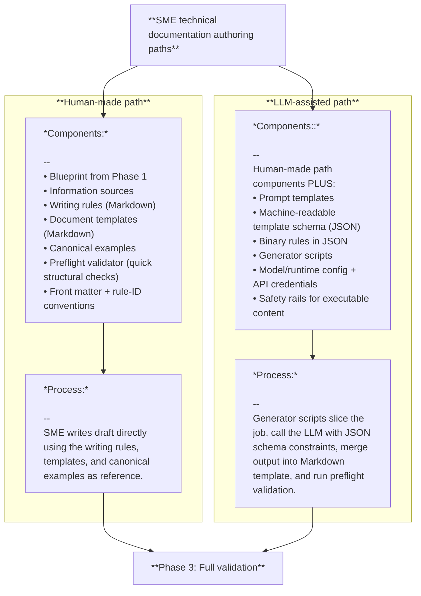

# Populate the structure

In this phase, you turn the blueprint from Phase 1 (the H1 and H2 headings outline) into a first draft. You can do this manually or with LLM assistance.

- Human-made: You write the draft directly using the writing rules, document templates, and canonical examples as reference.
- LLM-assisted: You use a language model to help generate the draft based on the blueprint and other inputs.

At the end of this phase, you should have a complete first draft of the document, ready for review and refinement in Phase 3.

