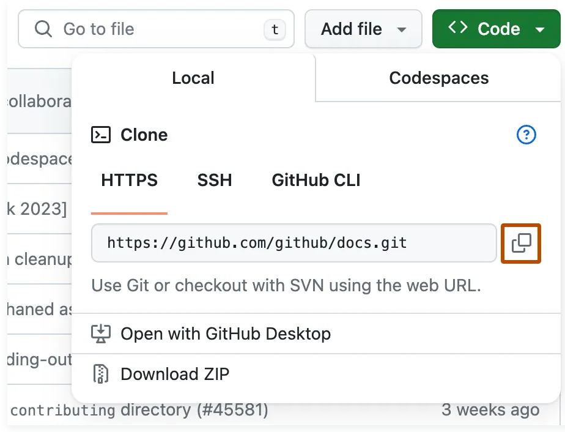
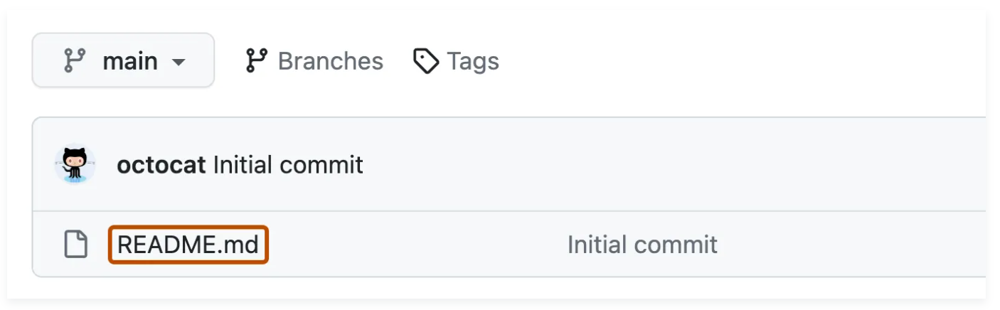

<!-- This document is an example for the concept template. It is not a real document and should be used for illustration purposes only. -->

# Quickstart

#### Create and manage your first repository quickly.

> 📒 **Note**  
> You can create repositories in your personal account or any organization where you have the required permissions.

## Overview

In this quickstart, you create a repository, edit a file, and clone the repository to your computer. This helps you begin collaborating or versioning your code immediately.

Repositories are project containers on GitHub. They store source code, configuration, and related files.

## Before you start

Before you begin, make sure you have:

- A GitHub personal or organization [account](https://docs.github.com/en/get-started/learning-about-github/types-of-github-accounts)
- [Git command line tool](https://git-scm.com/)

## Create a repository

1. In the upper-right corner of any GitHub page, click **+** and choose **New repository**.  
    
2. Enter a repository name.  
3. Optionally, add a description.  
4. For **Choose visibility**, select **Public** or **Private**.
5. Click the toggle to include add a README.
6. Click **Create repository**.   

## Commit a change to the README

A [commit](https://docs.github.com/en/get-started/learning-about-github/github-glossary#commit) is like a snapshot of all the files in your project at a particular point in time. Committing a change means to save your changes to the repository.

### Edit the README

1. In the upper-right corner of any GitHub page, click your profile picture, and then click **Your repositories**.
2. Click your repository name.
3. In your repository's list of files, select `README.md`.
    
4. In the upper right corner of the file view, click  to open the file editor.
5. In the text box, type some information about your project.
6. Above the new content, click **Preview**.
7. Review the changes you made to the file. If you select **Show diff**, you will see the new content in green.

### Commit the change

1. Click **Commit changes...**
2. In the **Commit message** field, type a short, meaningful commit message that describes the change you made to the file.
3. Select **Commit directly to the main branch**.
4. Click **Commit changes**.

## Clone the repository locally

Cloning a repository from GitHub.com to your local computer makes it easier to fix merge conflicts, add or remove files, and push larger commits.

### Copy the URL

1. In the upper-right corner of any GitHub page, click your profile picture, and then click **Your repositories**.
2. Click your repository name.
3. Above the list of files, click **<> Code**.
4. Under **HTTPS**, click .

### Clone the repository

1. Open a terminal on your computer.
2. Run `cd /path/to/your/directory` to change the current working directory to the location where you want the cloned directory.
3. Type `git clone`, and then paste the URL you copied earlier.

    ```shell
    git clone https://github.com/YOUR-USERNAME/YOUR-REPOSITORY
    ```

4. Press **Enter** to create your local clone.

    ```text
    $ git clone https://github.com/YOUR-USERNAME/YOUR-REPOSITORY
    Cloning into 'Spoon-Knife'...
    remote: Counting objects: 10, done.
    remote: Compressing objects: 100% (8/8), done.
    remote: Total 10 (delta 1), reused 10 (delta 1)
    Unpacking objects: 100% (10/10), done.
    ```

## Next steps

- [Create a repository from a template](https://docs.github.com/en/repositories/creating-and-managing-repositories/creating-a-repository-from-a-template)
- [Manage user access to your organization's repositories](https://docs.github.com/en/organizations/managing-user-access-to-your-organizations-repositories)
- [Add a security policy to your repository](https://docs.github.com/en/code-security/getting-started/adding-a-security-policy-to-your-repository)
