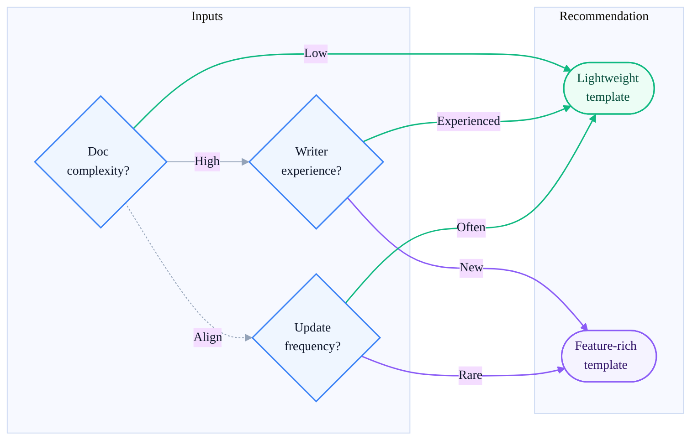

# Templates

This directory contains templates to create new technical documents for Logos. Templates help maintain consistency and save time when creating similar types of content.

- [Quickstart template](./quickstart-template.md)
- [Concept template](./concept-template.md)
- [Procedure template](./procedure-template.md)
- [Reference template](./reference-template.md)

## Using templates

Templates are Markdown files. To use a template, copy the desired template content and paste it into your new document. Then, fill in the relevant sections with your content.

> **Note:**
>
> Your content should follow the structure and guidelines provided in the template. Don't modify the template to fit your content. If you need to update a template, send a pull request with your changes following the [contribution guidelines](../../CONTRIBUTING.md).

## Guided vs. minimal templates

The templates in this section use a guided approach, providing detailed instructions and examples to help you structure your content effectively.

Unlike minimal templates, which offer only basic headings and leave much of the structure up to the author, guided templates are dense with content and may feel overwhelming at first. This initial density is intentional: it makes expectations explicit, prevents omissions, and typically shortens drafting and review time.
 
The rationale for using guided templates instead of minimal templates is twofold:

1. **Reduce context switching**: Minimize the need for authors to jump between resources (e.g., writing rules and examples) while drafting. Guided templates provide instructions and examples in one place.
2. **Support inexperienced authors**: SMEs are typically not trained as technical writers. For highly technical content that is not frequently updated, guided templates are the most effective way to help inexperienced authors produce complete and clear documentation.
This diagram illustrates this situation:

