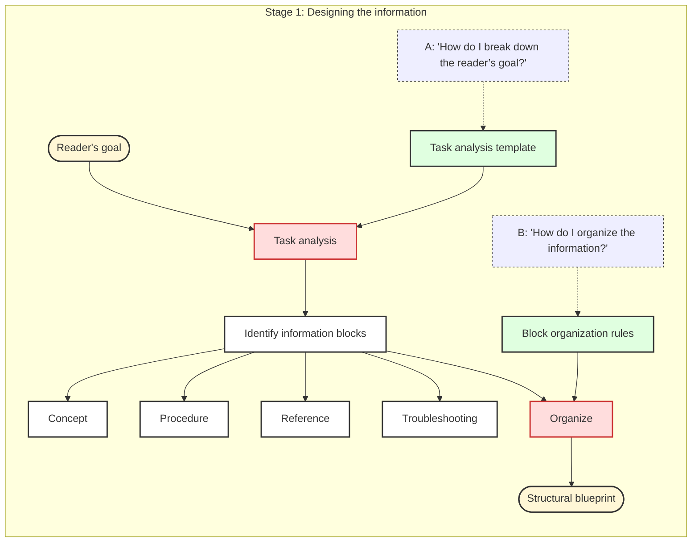
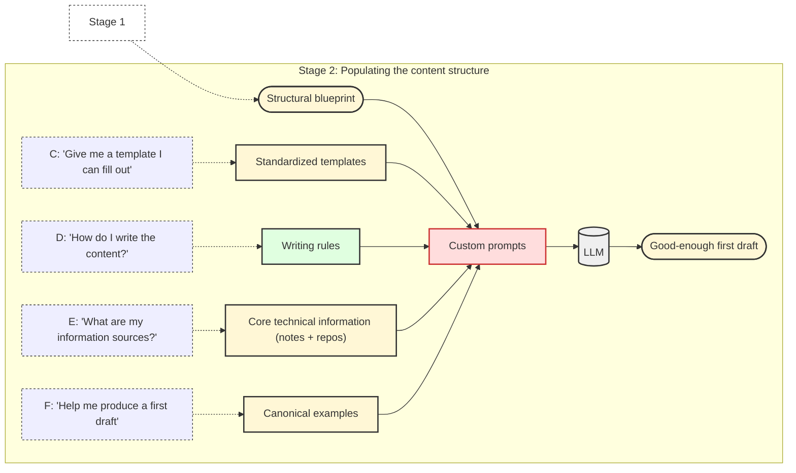
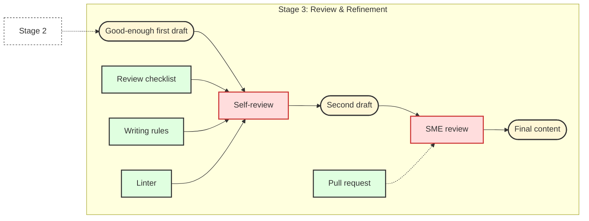
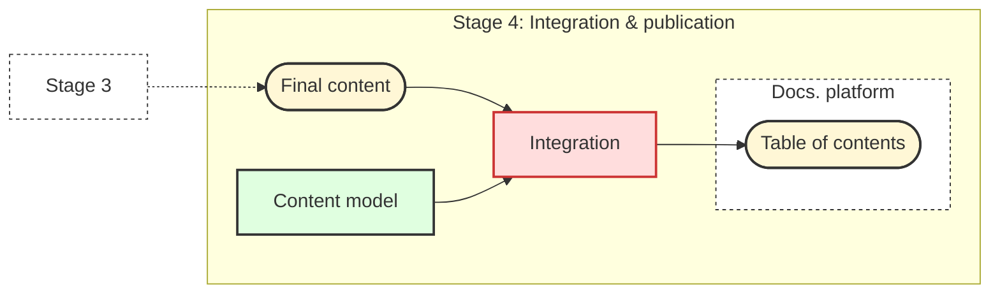

# IFT technical documentation guide

This guide is for the subject-matter experts (SMEs) who contribute to [IFT projects](https://free.technology/) ↗ documentation: the developers, infrastructure engineers, and other technical contributors responsible for designing and implementing features. It is written for technical experts who need to produce clear, effective documentation for the solutions they create, but who are not professional technical writers.

Our core assumption is that the primary barrier to writing documentation is the lack of a clear and repeatable process. This guide provides that process. It is designed to remove ambiguity, eliminate "blank page" anxiety, and offers a predictable workflow to create high-quality documentation consistently.

This guide is structured so you can quickly find the process, rules, and resources you need for any documentation task.

## How this guide is organized

The guide is divided into three main parts:

- **Stages**: A detailed walkthrough of the four stages of the documentation workflow: design the information, populate the content structure, validate the design, and integrate into the overall structure.  
- **Writing rules**: Practical instructions on how to write and format content so it is consistent, clear, and easy to maintain.  
- **Annexes**: Reference material such as templates, examples, checklists, and other aids to support you in each stage of the workflow.  

You can read the guide from beginning to end to learn the full process, or jump directly to the section that matches the task at hand.

## The documentation workflow

This section provides an end-to-end overview of the documentation process, from initial analysis to final integration. Use it to understand each part of the workflow and how they connect.

### Stage 1: Design the information

| Element | Description |
|:--------|:------------|
| Description | Identify the reader’s goal, perform a guided task analysis, and decompose the goal into core information blocks (Concept, Procedure, Reference, Troubleshooting). Organize these blocks into a structural blueprint. |
| Goal | Define scope and structure before writing, ensuring alignment with the reader’s goal. |
| Input | Feature code, user stories, design files, and any other existing documentation. |
| Output | A content organization plan (blueprint) that specifies what documents are needed and how information will be structured. |
| Tools | - Task analysis template - Information blocks organization rules |

### Stage 2: Populate the content structure

| Element | Description |
|:--------|:------------|
| Description | Translate the blueprint into a "good-enough" first draft by filling predefined templates with content drawn from technical sources. Use canonical examples and, where useful, LLMs to assist in generating text. |
| Goal | Produce a "good-enough" first draft that matches the designed structure and reduces ambiguity in what needs to be written. |
| Input | Structural blueprint from [Stage 1](#stage-1-design-the-information), technical notes, repository content, templates, and examples. |
| Output | A structured "good-enough" draft of the required document(s). |
| Tools | - Templates - Canonical examples - Writing rules - Custom prompts for LLM assistance |

### Stage 3: Validate the design

| Element | Description |
|:--------|:------------|
| Description | Improve and refine the draft through self-review, applying checklists, writing rules, and linters. Incorporate additional content as needed. Submit the draft in a GitHub pull request, where SMEs review the content for technical accuracy and confirm that it effectively supports the user. |
| Goal | Ensure the documentation is accurate, complete, and structured according to the design. |
| Input | "Good-enough" draft from [Stage 2](#stage-2-populating-the-content-structure). |
| Output | Reviewed and refined documentation, technically validated and structurally consistent. |
| Tools | - Review checklists - Writing rules - Linter - GitHub pull request review |

### Stage 4: Integrate into the overall structure

| Element | Description |
|:--------|:------------|
| Description | Add the approved document to the documentation site. Use the content model to define its location and relationship to other content in the table of contents. |
| Goal | Make the documentation organized, discoverable, and connected to related content. |
| Input | Reviewed and approved documentation from [Stage 3](#stage-3-validate-the-design). |
| Output | Published documentation, integrated into the overall structure. |
| Tools | - Content model - Documentation publishing platform |

