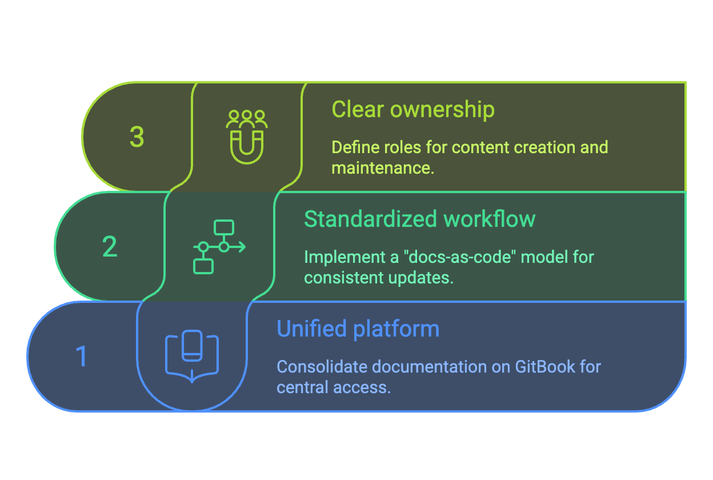

# OneDoc project briefing

A unified, AI-aware stack for IFT user docs

--- 

# OneDoc project goal

	To unify IFT's user-facing documentation on an AI-native platform (GitBook) with a "docs-as-code" workflow and clear roles, ensuring consistent, high-quality, and easily discoverable documentation to encourage greater developer adoption and contributions.

	<SlideCurrentNo /> / <SlidesTotal />

---

# Current documentation pain points

- **Fragmented toolchain:** Multiple documentation tools and workflows lead to inefficiencies
- **Uneven content quality:** Inconsistent documentation quality across projects
- **Unclear onboarding:** New contributors struggle to understand where to start
- **Missing key information:** Important concepts are often buried or not documented at all
- **Lack of standards:** Lack of structure makes docs hard to write, maintain, and browse
- **Diluted ownership:** Docs are treated as a side task, with no clear accountability

	<SlideCurrentNo /> / <SlidesTotal />

---

# Proposed solution: Unified documentation framework

  

	<SlideCurrentNo /> / <SlidesTotal />

---

# 1️⃣ What does **unified platform** mean?

	Consolidate all user-facing documentation for IFT projects onto a single, AI-native platform, specifically GitBook, to provide a central access point for users.

	<SlideCurrentNo /> / <SlidesTotal />

---

# 2️⃣ What does **standardized workflow** mean?

	Establish a standardized workflow for creating and updating documentation using a "docs-as-code" model, with all content stored in a single GitHub monorepo, to align methods and facilitate contributions.

	<SlideCurrentNo /> / <SlidesTotal />

---

# 3️⃣ What does **clear ownership** mean?

	Federated ownership model

	Define clear roles and responsibilities, including a project team (technical writers) and dedicated documentation owners within each IFT project, to ensure accountability for content creation and maintenance.

	Documentation owners continue reporting to their respective team leads, and not the project team, ensuring that writers fully integrate and align with their own team. This federated model avoids a centralized "IFT Docs" department.

	<SlideCurrentNo /> / <SlidesTotal />

---

# Project phases

| **Phase**                                         | **Main steps**                                         |
|:--------------------------------------------------|:-------------------------------------------------------|
| 0. Project documentation (I) and kick-off ⬥       | Project documentation and approval                     |
| 1. GitBook and domain config ⬥                   | GitBook deployment and configuration and domain setup     |
| 2. Monorepo setup ⬥                               | GitHub repository configuration                                   |
| 3. Project documentation (II) ⬥                   | Content guidelines (style guide) and templates                              |
| 4. Pilot migration ⭑                              | Migration, scripting, manual updates, and auditing     |
| 5. Pilot review ⭑                                 | Content clean-up and review                            |

--

##### ⬥ Once only / ⭑ Once per IFT project

	<SlideCurrentNo /> / <SlidesTotal />

---

# Project phases (cont.)

| **Phase**                                         | **Main steps**                                         |
|:--------------------------------------------------|:-------------------------------------------------------|
| 6. Feedback and adjust ⭑                          | Gather feedback, update workflows                      |
| 7. Project documentation (III) ⬥                  | Style guide and templates updates                      |
| 8. Linter implementation ⬥                        | Write VALE linter rules and linter implementation      |
| 9. Project documentation (IV) ⬥                   | Training materials                                     |
| 10. Training and mentoring ⭑                      | Training and mentoring the IFT project owner|

--

##### ⬥ Once only / ⭑ Once per IFT project

	<SlideCurrentNo /> / <SlidesTotal />

---

# Out of scope

- Adapting existing docs -- Update the existing documentation to follow standards
- Implementing analytics -- Configure GitBook analytics, prioritizing users' privacy

While these tasks are outside the direct scope of this project, we will provide the necessary support to facilitate their implementation.

	<SlideCurrentNo /> / <SlidesTotal />

---
zoom: 0.7
---

# Project snapshot

| #  | Phase                              | State | Progress |
|----|------------------------------------|:-----:|:--------:|
| 1  | Project plan and kick-off          | 🟡    | 🟩🟩🟩⬜⬜ |
| 2  | GitBook and domain setup           | ⚪    | ⬜⬜⬜⬜⬜ |
| 3  | Repo scaffold                      | 🟡    | 🟩🟩🟩⬜⬜ |
| 4  | Style guide and templates (v1)     | 🟡    | 🟩⬜⬜⬜⬜ |
| 5  | Pilot migration                    | ⚪    | ⬜⬜⬜⬜⬜ |
| 6  | Pilot review                       | ⚪    | ⬜⬜⬜⬜⬜ |
| 7  | Feedback and adjustments           | ⚪    | ⬜⬜⬜⬜⬜ |
| 8  | Style guide and templates (v2)     | ⚪    | ⬜⬜⬜⬜⬜ |
| 9  | Linter implementation              | ⚪    | ⬜⬜⬜⬜⬜ |
| 10 | Training materials                 | ⚪    | ⬜⬜⬜⬜⬜ |
| 11 | Training and mentoring             | ⚪    | ⬜⬜⬜⬜⬜ |

🟢 Done 🟡 In progress ⚪ Not started 🔴 Blocked

	<SlideCurrentNo /> / <SlidesTotal />

