# Task analysis

## What is task analysis?

Good documentation helps people to get things done. Task analysis is the process of figuring out what those "things" are.

Task analysis takes place before you start writing documentation. By analyzing the tasks the developers need to perform, you create a clear structure for your documentation, focus on what's important, and avoid writing unnecessary content.

> **Tip:**
>
> Task analysis forces you to stop and think about the developer's goals before writing the correct approach. It shifts the focus from "what I know" to "what the developer needs to do".

The result of task analysis is a content organization plan (blueprint) that specifies the documents you need to explain a certain feature, and how the information is structured within those documents.

## Why is task analysis important?

The quality of your task analysis determines the quality of your documentation and the time it takes to write it. It is safe to say that the more time you spend on task analysis, the less time you will spend on writing. On average, professional technical writers don't spend more than 15-20% of their time writing. This is only possible because they use task analysis to know exactly what to write.

This guide provides a step-by-step approach to task analysis for developer documentation, with only the necessary background information to help you get started.

> **Info:** 
>
> Task analysis for user and developer documentation share the same principles and goals but differ in important details. This guide focuses on developer documentation.

## Task analysis in the documentation process

Task analysis is a foundational step in the documentation workflow. As outlined in this guide's intro, it fits into [Stage 1: Design the information](#link-needed), as illustrated in this diagram:

```mermaid
flowchart LR
    subgraph S1["Stage 1: Design the information"]
        RG([Reader's goal]):::artifact --> TA["Task analysis<br/>👉 You are here"]:::action

        TA:::here

        %% Information blocks cluster
        TA --> IB["Identify information blocks"]:::main
        IB --> Cpt["Concept"]:::main
        IB --> Proc["Procedure"]:::main
        IB --> Ref["Reference"]:::main
        IB --> Troub["Troubleshooting"]:::main

        IB --> ORG["Organize"]:::action --> SB([Structural blueprint]):::artifact

        %% Supporting tools (solid links, their own style)
        TAT["Task analysis template"]:::tool --> TA
        BOR["Block organization rules"]:::tool --> ORG

        %% Questions (dashed links)
        Q1["A: 'How do I break down the reader’s goal?'"]:::support -.-> TAT
        Q2["B: 'How do I organize the information?'"]:::support -.-> BOR
    end

    %% Styles
    classDef main fill:#fff,stroke:#333,stroke-width:2px
    classDef artifact fill:#FFF7D6,stroke:#333,stroke-width:2px
    classDef action fill:#fdd,stroke:#c33,stroke-width:2px
    classDef tool fill:#e0ffe0,stroke:#333,stroke-width:2px
    classDef support fill:#eef,stroke:#333,stroke-dasharray:3 3
    classDef here fill:#ffeb3b,stroke:#f57c00,stroke-width:3px
```

## Task analysis steps

Task analysis consists of four differentiated steps:

1. Decompose developer's goal
2. Annotate procedural tasks
3. Name the tasks
4. Group related tasks

This table and diagram summarizes the process:

| # | Step | Description | Outcome |
|:-:|:-----|:------------|:--------|
| 1 | Decompose developer's goal | Define the developer's high-level objective and break it down into constituent parts. | A rough, unordered list of tasks (procedures), concepts, and references. |
| 2 | Annotate procedural tasks | Add context to each procedural task by identifying prerequisites, cautions, notes, and code snippets. | An enriched version of the original task list with additional context. |
| 3 | Name the tasks | Transform rough descriptions of procedural tasks into clear and consistent H1 and H2 titles using the docs standards. | A list of standardized task names that can be used as document headings. |
| 4 | Group related headings | Organize the headings into logical groups representing the structure of the document. | A structured outline of one or more documents reflecting the relationships between tasks. |

The [task analysis guide](task-analysis-guide.md) integrates all steps, examples, and tips into one self-contained guide, so you can complete the analysis without navigating between documents. Start your analysis there.
